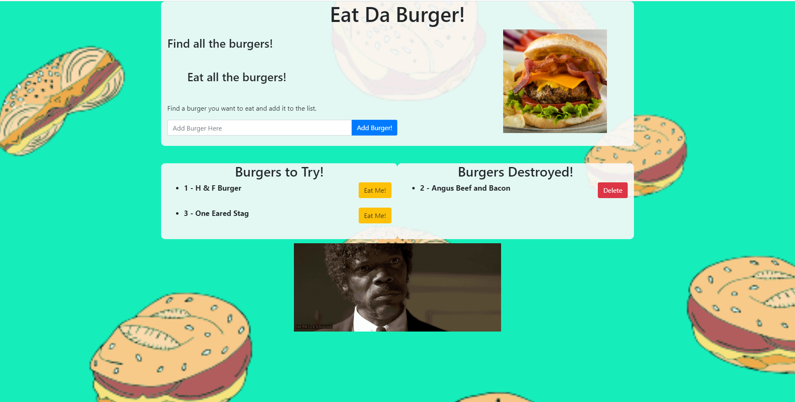

# Eat Da Burger

## Description  


[App Link](https://peaceful-hamlet-07367.herokuapp.com/)

Eat-Da-Burger! A restaurant style app using MySQL, Node, Express, Handlebars, and a homemade ORM that allows a users to keep track of tasty burgers they would like to eat or have eaten.  User can input a burger to add to the list of burgers to eat.  Once the user has been able to consume this tasty treat, they can then press the "Eat Me!" button to move the burger to the "Burger's Destroyed" list.  If a user was not a fan of the consumed burger, and would rather forget about the experience they can simply click "Delete" to remove it from the database. 

* 

<br>
<br>
<br>

## Table of Contents  
  
* [Installation](installation-instructions)  
* [Usage](#usage-instructions)  
* [License](#license)  
* [Questions](#questions)

<br>
<br>
<br>

## Installation Instructions

* Follow [Link](https://github.com/jeashwor/burger) to application GitHub repository.

* Locate Green "Code" button and select the clipboard to copy repo data.

* Using your preferred terminal application navigate to your desired location to copy the repository folder using the git clone command along with the info copied from the GitHub page in the above step.

* Run a npm install command to install necessary modules.

    ```
    npm i
    ```

* Now open the connection.js file in the config folder and enter your username and password in the areas noted to link to your MySQL database.

* Now you are now ready to run the application locally by using node server.js and going to localhost:8080 in your browser!

<br>
<br>
<br>

## Usage Instructions

* Application is hosted live on heroku.  Use this [Link](https://peaceful-hamlet-07367.herokuapp.com/) to try it out!

<br>
<br>
<br>

## License

* Application licensed under MIT.  For more information see [license document](./LICENSE).
  
<br>
<br>
<br>

## Questions

Check out my GitHub page here:  [jeashwor's Page](https://github.com/jeashwor)

If you have additional questions please email me at jeashwor@gmail.com